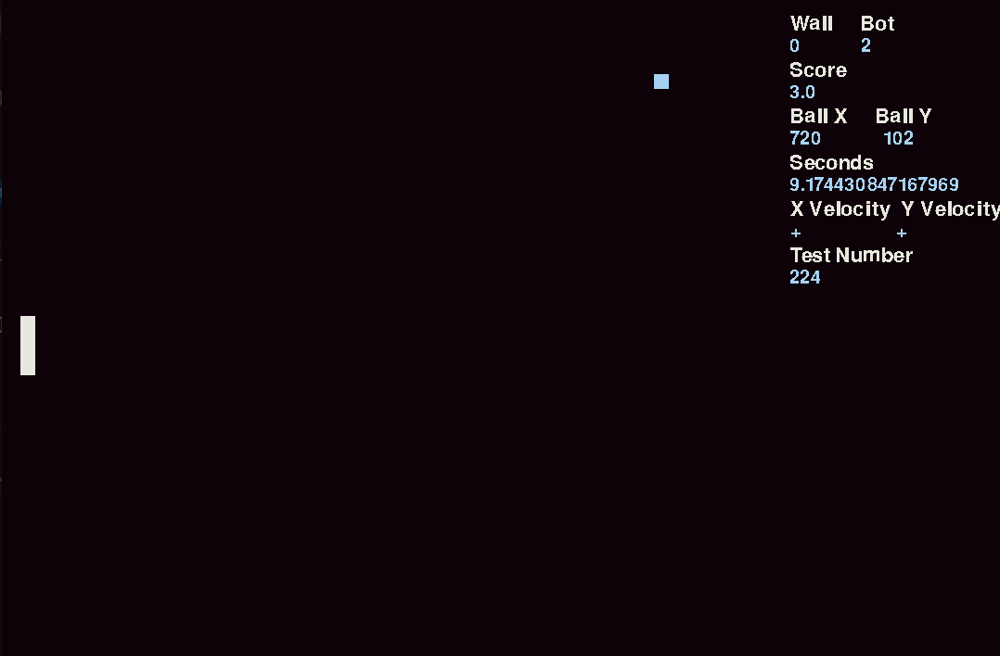

# The effect of bot type on score in the game pong
#### By Ian Koide



## Table of Contents
[Info](#rules-and-info)

[Code Analysis](#code-analysis)
- [Bots](#bots)
- [Handling](#handling)
- [Class Dissection](#classes)

[Bugs](#bugs)

[Acknowledgments](#acknowledgments)

### Rules & Info
#### Screen
- Height: 720
- Width: 1080
#### Paddle
- Height: 64
- Width: 16
- Velocity: 12
#### Ball
- Height: 16
- Width: 16
- Velocity: 17

# Code Analysis
## Bots
### Bot #1 Explained
```
paddle.y += paddle.velocity
```
Bot #1 is the simplest of the bots, its constantly moving down.

### Bot #2 Explained
```
if ball.y > paddle.y:
    paddle.y += y.velocity
if ball.y < paddle.y:
    paddle.y -= paddle.velocity
```
Bot #2 is also pretty simple. If the balls y position is above the paddle then the paddle moves up, if its bellow it moves down.

### Bot #3 Explained
```
if ball.y <= 180 and paddle.y >= 540:
    paddle.y += paddle.velocity

elif ball.y >= 540 and paddle.y <= 180:
    paddle.y -= paddle.velocity

else:
    if ball.y > paddle.y:
        paddle.y += paddle.velocity

    if ball.y < paddle.y:
        paddle.y -= paddle.velocity
```
Bot #3 is similar to bot #2 except that if the ball is above a certain height and the paddle is bellow a certain height then the ball will move in the opisite direction taking less time to get to the ball. It is the same when the ball is bellow a certain point and the paddle is above a certain point.

### Bot #4 Explained
```
global target

if ball.x > 1060 and ball.x < 1080:
    # Up
    if ball.yvelocity / 17 == 1:
        if ball.y > 360:
            target = (1080 - ball.y) - (paddle.height / 2) + 17
            print(paddle.y , "Single Up")

        elif ball.y < 360:
            target = (360 + ball.y)  - (paddle.height / 2) # Wrong
            print(paddle.y , "Double Up")

    # Down      
    else:
        if ball.y < 360:
            target = (360 - ball.y) + (paddle.height / 2) - 17 # Wrong
            print(paddle.y , "Single Down")

        if ball.y > 360:
            target = (ball.y - 360) - (paddle.height / 2)
            print(paddle.y , "Double Down")

if target > paddle.y:
    paddle.y += paddle.velocity

elif target < paddle.y:
    paddle.y -= paddle.velocity

else: 
    pass
```
#### Calculation and Trajectories
Bot #4 calculates where the ball will end up on the side of the screen with the paddle. The first if statement is to check if the ball is in the calculation range.
```
if ball.x > 1060 and ball.x < 1080: 
```
The next if statement inside the first is checking if the balls velocity is positive or negative.
```
if ball.yvelocity / 17 == 1:
```
this means its positive, and
```
else:
```
means its negative. If the ball y position is greater than 360 than it is either going to make a double bounce down or a single bounce up. If its less than 360 than it will make a double bounce up or a single bouce down.
``` Seles, back in those days, WAS JUST NOT AFRAID. OF NO ONE ! 
if ball.y > 360:
```
or
```
if ball.y < 360:
```
Then you use the formula screen width - ball y position to find where the ball will end up. After that you have to subtract the paddle height divided by 2 because the x position of the paddle is in the top corner not the middle. Then add the velocity of the paddle. See [Wall Velocity Bug 0.1](##wall-velocity-bug-01).

#### Formulas
##### Single bounce up
```
(1080 - ball.y) - (paddle.height / 2) + 17
```
##### Single bounce down
```
(360 - ball.y) + (paddle.height / 2) - 17
```
##### Double bounce up
```
(360 + ball.y)  - (paddle.height / 2)
```
##### Double bounce down
```
(ball.y - 360)  - (paddle.height / 2)
```
#### Moving Paddle
```
if target > paddle.y:
    paddle.y += paddle.velocity

else:
    paddle.y -= paddle.velocity
```
This if statement works the same way as bot #2, the target variable is set when finding where to move the paddle and then the movement is executed. The reason why I don't just move the paddle to the projected cordinate is because that would be breaking game rules as max velocity is 17 for all bots.
## Game Handling
### Walls
```
if ball.y < (0 + ball.height):
    ball.y += 17
    ball.yvelocity *= -1

if ball.y > (720 - ball.height):
    ball.y -= 17
    ball.yvelocity *= -1

if ball.x >= 1080 - ball.height:
    ball.xvelocity *= -1
    paddle.score2 += 1

if ball.x <= 0:
    ball.x = 1080
    ball.y = randint(1,719)
    paddle.score += 1
    ball.yvelocity = 1

if paddle.y <= 0 - paddle.height:
    paddle.y = 720

if paddle.y >= 720 + paddle.height:
    paddle.y = 0
```
```
if ball.y < (0 + ball.height):
    ball.y += 17
    ball.yvelocity *= -1
```
and
```
if ball.y > (720 + ball.height):
    ball.y -= 17
    ball.yvelocity *= -1
```
These are to make sure the ball bounces back when it hits the top or bottom of the screen. It reverses the velocity and then adds or subtracts 17 depending on if its the top or bottom.
```
if ball.x >= 1080 - ball.height:
    ball.xvelocity *= -1
    paddle.score2 += 1
```
This is to check if the balls x position is greater than 1080, then if it is it reverses the velocity and adds 1 point to the bot.
```
if ball.x <= 0:
    ball.x = 1080
    ball.y = randint(1,719)
    paddle.score += 1
    ball.yvelocity = 1
```
This is to check if the balls x position is less than 0, if so it resets the ball position to 1080, sets the y position to a random number, adds 1 point to the wall and makes the velocity positive.
```
if paddle.y <= 0 - paddle.height:
    paddle.y = 720

if paddle.y >= 720 + paddle.height:
    paddle.y = 0
```
These are to check if the paddles y position is above 0 or bellow 720. If so it moves the paddle to either the top or bottom of the screen.
### Collision
```
colliding = x.hitbox.colliderect(y.hitbox)

if colliding:
    x.x += 75
    x.xvelocity *= -1
```
```
colliding = ball.hitbox.colliderect(paddle.hitbox)
```
This is using my hitbox class in both objects with the pygame function colliderect.
```
if colliding:
    ball.x += 75
    ball.xvelocity *= -1
```
## Classes
### Paddle
```
class Paddle(object):
    # Initializing variables for a paddle
    def __init__(self, x):
        self.name = paddle
        self.x = x
        self.y = 550
        self.velocity = 12
        self.height = 64
        self.width = 16
        self.hitbox = pygame.Rect(self.x, self.y, self.width, self.height)
        self.score = 0
        self.score2 = 0
```
If the ball and paddle are colliding then the balls velocity is reversed and 75 is added to the balls x. This is simulating the bouncing off effect.
## Bugs & Troubes
#### Velocity Bug, **0.0**
The velocity bug is due to the fact that the ball skips every 17 pixels so this breaks a lot of my game mechanics. For example:

This pretty much effects every mechanic. The usual temporary fix is to just make a range of at least 17 when trying to sense collision etc. The permanent fix would be to add a new variable, something like speed. This would allow me to change this variable and multiply it times velocity to get certain effects while keeping a constant 17.

#### Wall Velocity Bug, **0.1**
When the ball hits the top or bottom wall it can hit anywhere from 0 or 720 to -17 or 729 due to the velocity being 17. Because of my walls mechanics if the ball y position is less than 0 or greater than 720 it reverses the velocity. 17 needs to be added or subtracted for it to not get caught on the wall and glitch out. But because sometimes it only bounces once for example a single bounce up the ball will be slightly off the predicted path. That is why on a single bouce 17 must be added or subtracted from the paddle y position to center it back out.

#### Pygame Cordinate System, **0.2**
In pygame 0 is at the top left of the screen. For example 1080, 720 would be at the bottom right of the screen, not top left. This interferes with some operations and confused me a lot during the process of making the game. It's not a big deal just something that caused me some confusion.

## Acknowledgments
##### Help with trajectory prediction - Brian Koide
##### Game engine - Pygame Module